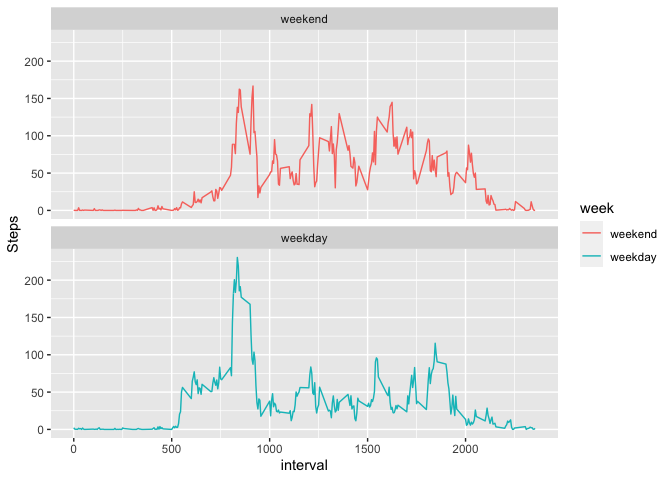

## Loading and preprocessing the data

```r
## Loading dependent libraries
library(dplyr)
```

```
## 
## Attaching package: 'dplyr'
```

```
## The following objects are masked from 'package:stats':
## 
##     filter, lag
```

```
## The following objects are masked from 'package:base':
## 
##     intersect, setdiff, setequal, union
```

```r
library(tidyr)
## Reading the files
act_df <- read.csv(unzip('activity.zip'))
## Converting the date field
act_df$date <- as.Date(act_df$date,format="%Y-%m-%d")
```


## What is mean total number of steps taken per day?

```r
##Aggreeate by date
act_df_agg <- act_df %>%
  group_by(date) %>%
  summarise(Freq= sum(steps,na.rm = TRUE)) 


## Histogram to indicate mean of total steps taken per day. 
hist(act_df_agg$Freq, main ="Total Steps per day", xlab ="Steps" , col= "thistle")
abline(v = mean(act_df_agg$Freq,na.rm = TRUE),                       # Add line for mean
       col = "blue",
       lwd = 3)
text(x = round(mean(act_df_agg$Freq,na.rm = TRUE),2)-3000,                   # Add text for mean
     y = 15,
     paste("Mean =", round(mean(act_df_agg$Freq,na.rm = TRUE),2)),
     col = "blue",
     cex = 1)
abline(v = median(act_df_agg$Freq,na.rm = TRUE),                       # Add line for median
       col = "red",
       lwd = 3)
text(x = round(mean(act_df_agg$Freq,na.rm = TRUE),2)-3000,                   # Add text for median
     y = 20,
     paste("Median =", round(median(act_df_agg$Freq,na.rm = TRUE),2)),
     col = "red",
     cex = 1)
```

<!-- -->

## What is the average daily activity pattern?

```r
## Removing NA's from the steps and replacing by 0
##act_df$steps <-  replace_na(act_df$steps,0 )

##Finding Mean by intervals
act_df_agg2 <- act_df %>%
  group_by(interval) %>%
  summarise(Freq= mean(steps,na.rm = TRUE)) 

## Finding the 5 min interval that has got maximum steps  
max_internval <- act_df_agg2[which(act_df_agg2$Freq == max(act_df_agg2$Freq, na.rm = TRUE)), ]

plot(act_df_agg2$interval,act_df_agg2$Freq,type = "l", ylab = "Average Steps", xlab= "5 min Intervals across all days")
abline(h = mean(act_df_agg2$Freq,na.rm = TRUE),                       # Add line for mean
       col = "blue",
       lwd = 2,
       lty=3)
text(y = round(mean(act_df_agg2$Freq,na.rm = TRUE),2)+15,                   # Add text for mean
     x = 150,
     paste("Mean =", round(mean(act_df_agg2$Freq,na.rm = TRUE),2)),
     col = "blue",
     cex = 1)
abline(v = max_internval$interval,                       # Add line for Max Average
       col = "steelblue",
       lwd = 2,
       lty= 4)
text(y = max_internval$Freq-20,                   # Add text for Max Average
     x = max_internval$interval+400,
     paste("Max 5 min Interval =", max_internval$interval),
     col = "steelblue",
     cex = 1)
```

<!-- -->


## Imputing missing values

```r
## Merging the Earlier computed Data Frame in Chunck 2 that has mean interval values with original data frame

act_df_new <- merge(x=act_df,y=act_df_agg2,by="interval",all=TRUE)

##Mutate allong with Coalesce allows to replace NA with mean value for that interval. 
act_df_1 <- mutate(act_df_new,impute_steps = coalesce(steps,Freq))
## 1. Finding NA values 
summary(act_df_1$steps)
```

```
##    Min. 1st Qu.  Median    Mean 3rd Qu.    Max.    NA's 
##    0.00    0.00    0.00   37.38   12.00  806.00    2304
```

```r
# NA's   :2304 
act_df_new <- select(act_df_1, date, impute_steps)

##Aggreeate by date, the value of Imputed steps.
act_df_agg_new <- act_df_new %>%
  group_by(date) %>%
  summarise(Freq= sum(impute_steps,na.rm = TRUE)) 
## Preparing a comparison histogram hence setting up Two columns
par(
  mfrow=c(1,2),
  mar=c(4,4,1,0)
)


## Histogram 1 of non Imputed dataframe to indicate mean of total steps taken per day. 
hist(act_df_agg$Freq, main ="Hist 1 (Non Imputed)", xlab ="Steps" , col= "thistle")
abline(v = mean(act_df_agg$Freq,na.rm = TRUE),                       # Add line for mean
       col = "blue",
       lwd = 3)
text(x = round(mean(act_df_agg$Freq,na.rm = TRUE),2)-3000,                   # Add text for mean
     y = 15,
     paste("Mean =", round(mean(act_df_agg$Freq,na.rm = TRUE),2)),
     col = "blue",
     cex = 1)
abline(v = median(act_df_agg$Freq,na.rm = TRUE),                       # Add line for median
       col = "red",
       lwd = 3)
text(x = round(mean(act_df_agg$Freq,na.rm = TRUE),2)-3000,                   # Add text for median
     y = 20,
     paste("Median =", round(median(act_df_agg$Freq,na.rm = TRUE),2)),
     col = "red",
     cex = 1)

## Histogram 2 of imputed data frame to indicate mean of total steps taken per day. 
hist(act_df_agg_new$Freq, main ="Hist 2(Imputed)", xlab ="Steps" , col= "tan")
abline(v = mean(act_df_agg_new$Freq,na.rm = TRUE),                       # Add line for mean
       col = "blue",
       lwd = 3)
text(x = round(mean(act_df_agg_new$Freq,na.rm = TRUE),2)-3000,                   # Add text for mean
     y = 15,
     paste("Mean =", round(mean(act_df_agg_new$Freq,na.rm = TRUE),2)),
     col = "blue",
     cex = 1)
abline(v = median(act_df_agg_new$Freq,na.rm = TRUE),                       # Add line for median
       col = "red",
       lwd = 3)
text(x = round(mean(act_df_agg_new$Freq,na.rm = TRUE),2)-3000,                   # Add text for median
     y = 20,
     paste("Median =", round(median(act_df_agg_new$Freq,na.rm = TRUE),2)),
     col = "red",
     cex = 1)
```

<!-- -->

**Do these values differ from the estimates from the first part of the assignment? 
What is the impact of imputing missing data on the estimates of the total daily number of steps?**
*A: Yes, there are differences observed between the two histograms, especially with the frequency occurrences on lower spectrum (0-10,000) of steps are changed. We see more frequency occurance when its non imputed on lower histogram categories. There is a sligth increase in the mean and median values but it does not drastically change.*

## Are there differences in activity patterns between weekdays and weekends?

```r
##Compute a date is Weekend or Weekday
##install.packages(timeDate) ## I had to install this via RStudio > tools> Install packages as somehow the package was not getting installed from chunck
library(timeDate)
## Refering the data frame from earlier which had the the imputed steps, interval and date
act_df_2 <- select(act_df_1, date,interval,impute_steps)

## Creating a factor for weekend vs weekday
act_df_2 <- mutate(act_df_2,day = isWeekend(date, wday = 1:5),week="")

act_df_2 <- within(act_df_2, week[day== TRUE] <- 'weekend')
act_df_2 <- within(act_df_2, week[day== FALSE] <- 'weekday')

act_df_2$week <- factor(act_df_2$week, levels = c("weekend", "weekday"))

##Finding Mean by Weekdays and Weekends intervals
act_df_avg3 <- act_df_2 %>%
  group_by(week,interval) %>%
  summarise(Freq= mean(impute_steps,na.rm = TRUE)) 
```

```
## `summarise()` has grouped output by 'week'. You can override using the `.groups` argument.
```

```r
library(ggplot2)
ggplot(act_df_avg3,aes(x=interval,y=Freq)) +
  geom_line(aes(color=week)) +
  ylab("Steps")+
  facet_wrap(~week,ncol=1)
```

<!-- -->


**The steps peak between the 750th and 1000th Interval for both the Weekends and Weekdays. Also the average of steps performed are more across weekends than Weekdays.** 
